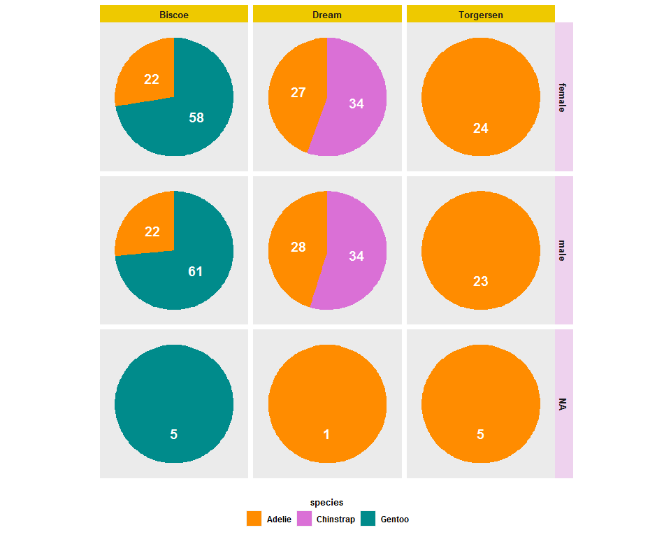
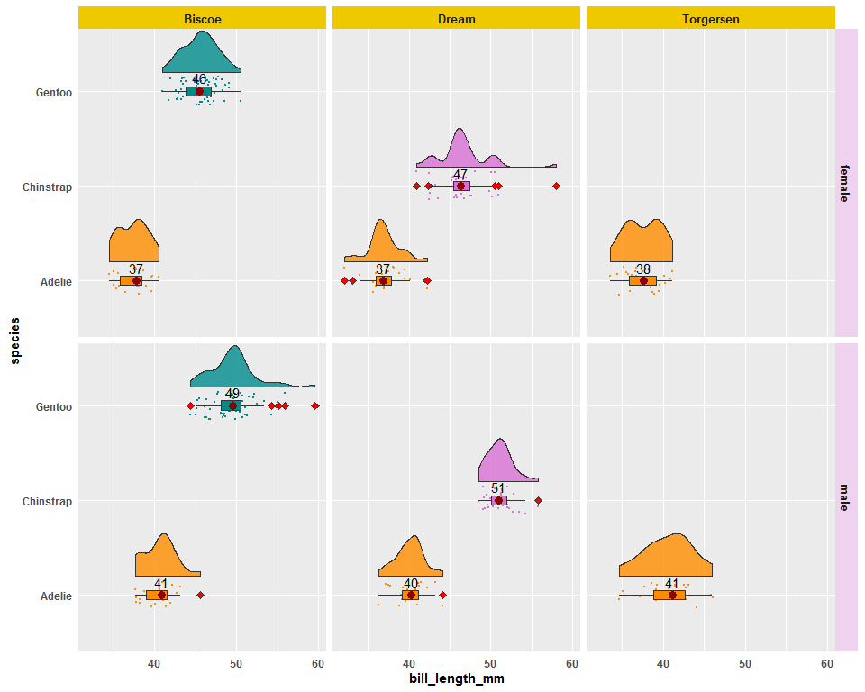
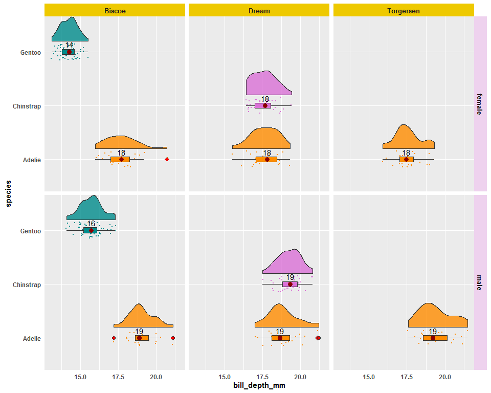
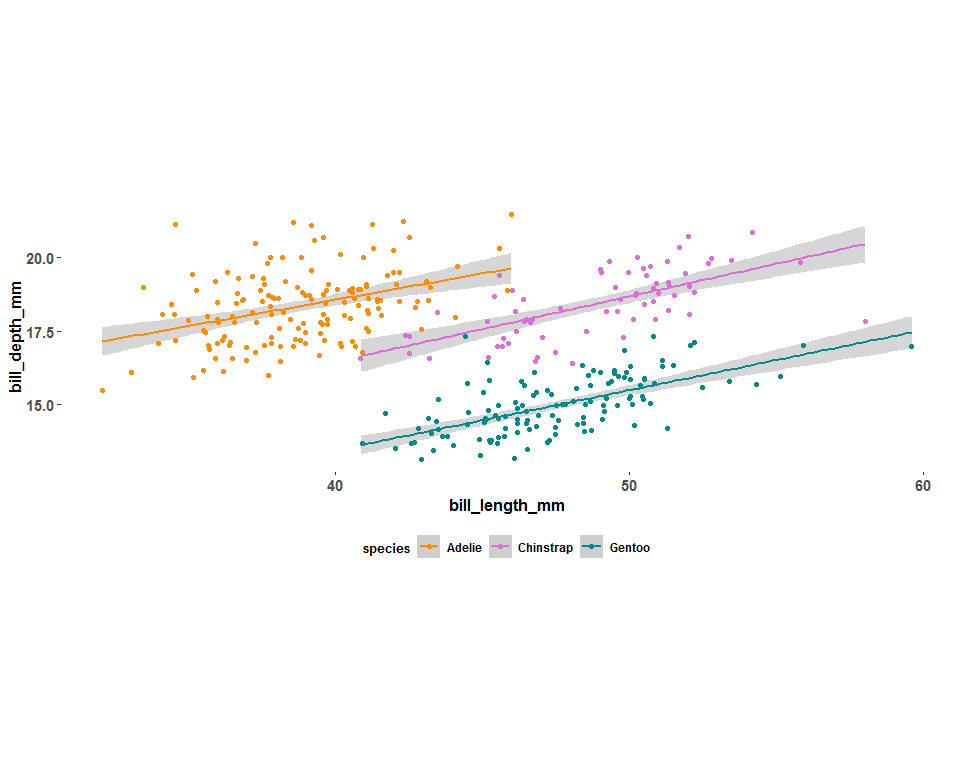
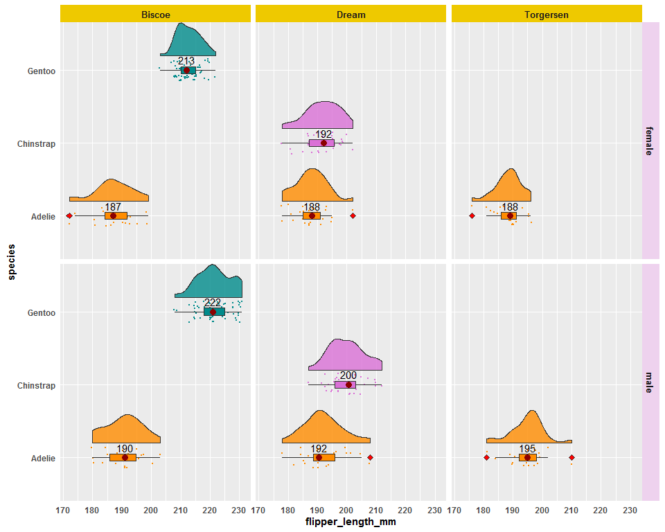
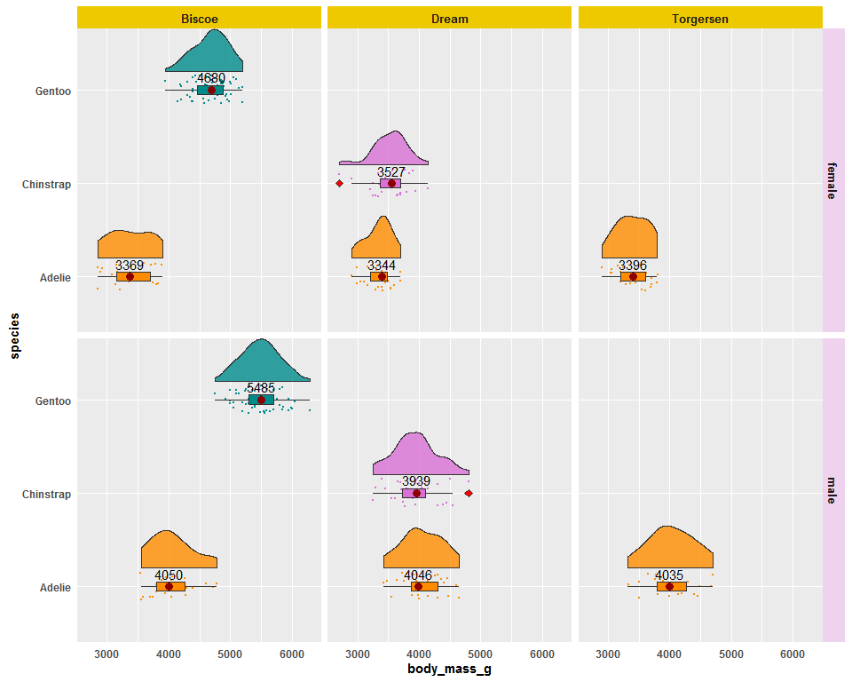
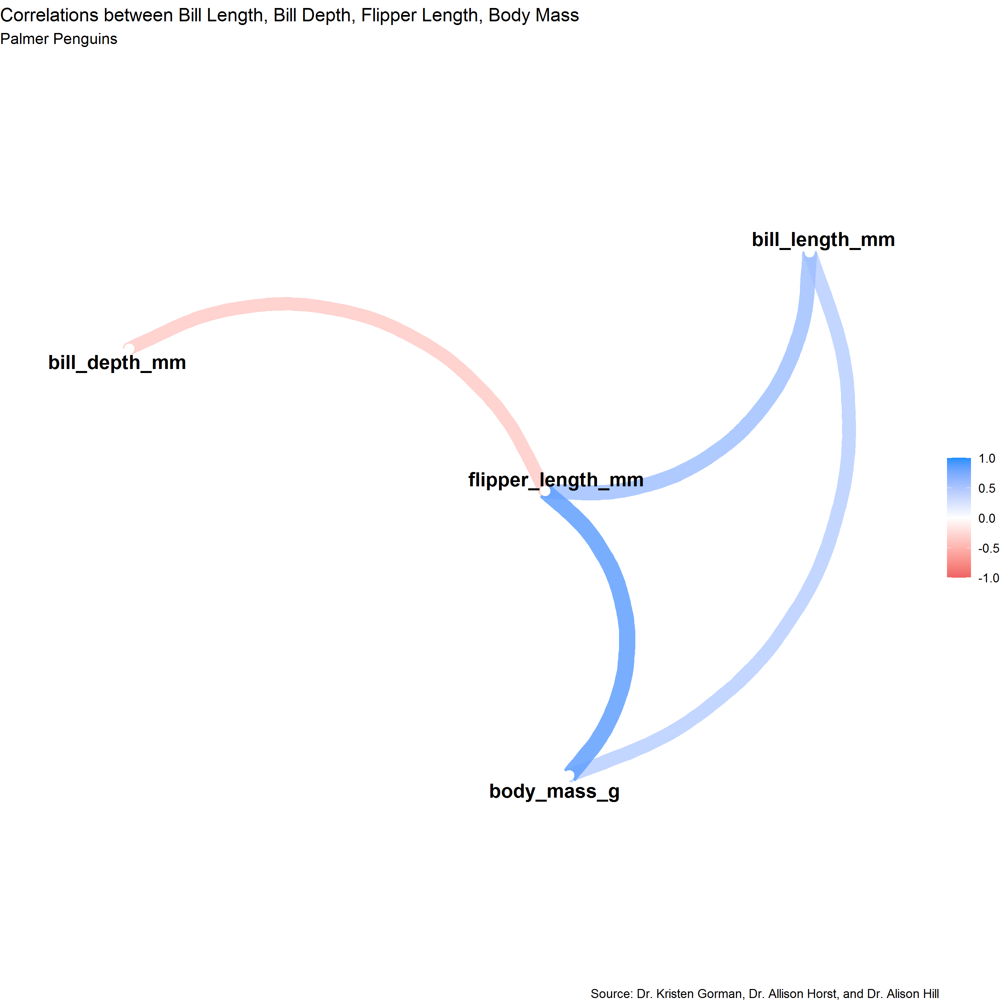
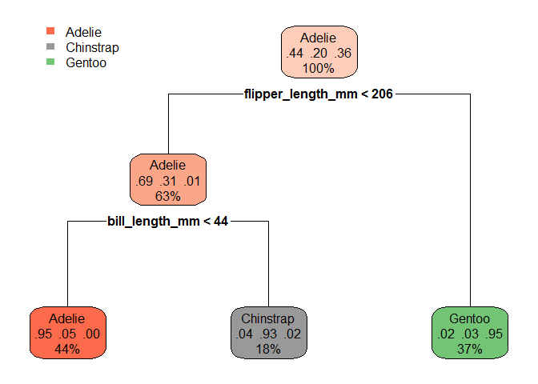
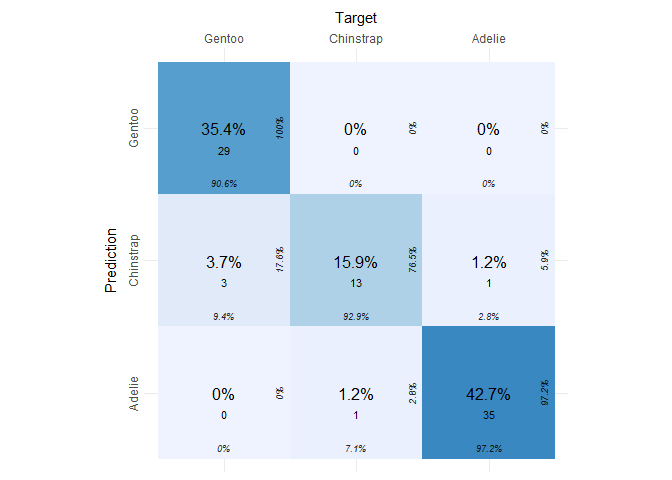

<b>Source:</b> [Dr. Kristen Gorman, Dr. Allison Horst, and Dr. Alison Hill.](https://doi.org/10.1371/journal.pone.0090081) <br>
[Data](https://allisonhorst.github.io/palmerpenguins/)


### Import the necessary packages


```r
{ 
  library(tidyverse)
  library(caret)
  library(plotly)
  library(data.table)
  library(psych)
  library(hrbrthemes)
  library(corrr)
  library(rpart)
  library(rpart.plot)
  library(cvms)

}
```


### Import the data


```r
# tuesdata <- tidytuesdayR::tt_load(2020, week = 31)
# penguins <- tuesdata$penguins
# penguins_raw<- tuesdata$penguins_raw
penguins<-read.csv("penguins.csv",header = T,na.strings = c(""," ","NA"))
penguins_raw<-read.csv("penguins_raw.csv",header = T,na.strings = c(""," ","NA"))
```

### Lets check the structure and summary of the data


```r
str(penguins)
```

```
## 'data.frame':	344 obs. of  8 variables:
##  $ species          : chr  "Adelie" "Adelie" "Adelie" "Adelie" ...
##  $ island           : chr  "Torgersen" "Torgersen" "Torgersen" "Torgersen" ...
##  $ bill_length_mm   : num  39.1 39.5 40.3 NA 36.7 39.3 38.9 39.2 34.1 42 ...
##  $ bill_depth_mm    : num  18.7 17.4 18 NA 19.3 20.6 17.8 19.6 18.1 20.2 ...
##  $ flipper_length_mm: int  181 186 195 NA 193 190 181 195 193 190 ...
##  $ body_mass_g      : int  3750 3800 3250 NA 3450 3650 3625 4675 3475 4250 ...
##  $ sex              : chr  "male" "female" "female" NA ...
##  $ year             : int  2007 2007 2007 2007 2007 2007 2007 2007 2007 2007 ...
```

```r
summary(penguins)
```

```
##    species             island          bill_length_mm  bill_depth_mm  
##  Length:344         Length:344         Min.   :32.10   Min.   :13.10  
##  Class :character   Class :character   1st Qu.:39.23   1st Qu.:15.60  
##  Mode  :character   Mode  :character   Median :44.45   Median :17.30  
##                                        Mean   :43.92   Mean   :17.15  
##                                        3rd Qu.:48.50   3rd Qu.:18.70  
##                                        Max.   :59.60   Max.   :21.50  
##                                        NA's   :2       NA's   :2      
##  flipper_length_mm  body_mass_g       sex                 year     
##  Min.   :172.0     Min.   :2700   Length:344         Min.   :2007  
##  1st Qu.:190.0     1st Qu.:3550   Class :character   1st Qu.:2007  
##  Median :197.0     Median :4050   Mode  :character   Median :2008  
##  Mean   :200.9     Mean   :4202                      Mean   :2008  
##  3rd Qu.:213.0     3rd Qu.:4750                      3rd Qu.:2009  
##  Max.   :231.0     Max.   :6300                      Max.   :2009  
##  NA's   :2         NA's   :2
```


### Lets check the various Species of Penguins and its counts


```r
penguins %>% group_by(species) %>% summarise(counts = n()) %>%
  plot_ly(
  labels = ~ species,
  values = ~ counts,
  type = 'pie',
  hole = 0.5,
  sort = F,
  textinfo = "label",
  direction = "clockwise",
  title = "<b>Species of Penguins</b>",
  showlegend = F
  )
```

<!--html_preserve--><div id="htmlwidget-25c4ae3b1d35b1820f89" style="width:672px;height:480px;" class="plotly html-widget"></div>
<script type="application/json" data-for="htmlwidget-25c4ae3b1d35b1820f89">{"x":{"visdat":{"8f82367eb2":["function () ","plotlyVisDat"]},"cur_data":"8f82367eb2","attrs":{"8f82367eb2":{"labels":{},"values":{},"hole":0.5,"sort":false,"textinfo":"label","direction":"clockwise","title":"<b>Species of Penguins<\/b>","showlegend":false,"alpha_stroke":1,"sizes":[10,100],"spans":[1,20],"type":"pie"}},"layout":{"margin":{"b":40,"l":60,"t":25,"r":10},"hovermode":"closest","showlegend":true},"source":"A","config":{"showSendToCloud":false},"data":[{"labels":["Adelie","Chinstrap","Gentoo"],"values":[152,68,124],"hole":0.5,"sort":false,"textinfo":"label","direction":"clockwise","title":"<b>Species of Penguins<\/b>","showlegend":false,"type":"pie","marker":{"color":"rgba(31,119,180,1)","line":{"color":"rgba(255,255,255,1)"}},"frame":null}],"highlight":{"on":"plotly_click","persistent":false,"dynamic":false,"selectize":false,"opacityDim":0.2,"selected":{"opacity":1},"debounce":0},"shinyEvents":["plotly_hover","plotly_click","plotly_selected","plotly_relayout","plotly_brushed","plotly_brushing","plotly_clickannotation","plotly_doubleclick","plotly_deselect","plotly_afterplot","plotly_sunburstclick"],"base_url":"https://plot.ly"},"evals":[],"jsHooks":[]}</script><!--/html_preserve-->

### Lets visualize various Species of Penguins by Sex and Island


```r
penguins  %>%  
  group_by(species,sex,island) %>% 
  summarise(counts=n()) %>% 
  ggplot(aes(x = "", y = counts, fill = species )) + 
  geom_bar(stat = "identity", position = position_fill()) +
  geom_text(aes(label = counts), size=5,
            fontface="bold",color="white",
            position = position_fill(vjust = 0.5)) +
  scale_fill_manual(values=c("darkorange", "orchid", "darkcyan"))+
  guides(fill=guide_legend(nrow=1, title.position = "top"))+
  coord_polar(theta = "y") +
  facet_grid(~sex~island)  +
  theme(axis.title.x = element_blank(),
        axis.title.y = element_blank(),
        strip.background.x =   element_rect(fill = "gold2"),
        strip.background.y =   element_rect(fill = "thistle2"),
        strip.text.x = element_text(size = 10, face="bold"),
        strip.text.y = element_text(size = 10, face="bold"),
        legend.position="bottom",
        legend.title = element_text(size = 10, face="bold",hjust = 0.5),
        legend.text = element_text(size = 9, face="bold"),
        axis.text = element_blank(),
        axis.ticks = element_blank(),
        panel.grid  = element_blank())
```



#### The above pie chart explains that in the Torgersen island only adelie penguins were identified, in that 5 species sex were not identified.In Dream island Adelie and Chinstrap penguins were identified.Gentoo penguins were only identified in Biscoe island.

### Lets perform the Exploratory Data Analysis


### Compare the bill_length_mm distribution with species and compare them with Sex and Island

#### Create a function to get the median value as dataframe


```r
fun_median <- function(x){
  return(data.frame(y=median(x),label=round(mean(x,na.rm=T) ,0) ))}
```
#### Import the flat violin funtion from github url


```r
source(
  "https://gist.githubusercontent.com/benmarwick/2a1bb0133ff568cbe28d/raw/fb53bd97121f7f9ce947837ef1a4c65a73bffb3f/geom_flat_violin.R"
)
```


```r
penguins %>% drop_na()    %>% 
  ggplot(aes(y=bill_length_mm,x=species,fill= species)) +
  geom_flat_violin(position = position_nudge(x = .2, y = 0), alpha = .8)+
  geom_point(aes(y = bill_length_mm, color = species), 
             position = position_jitter(width = .15), size = .5, 
             alpha = 5)+
  geom_boxplot(width=.1,
               outlier.fill  ="red", outlier.shape=23,
               outlier.size=2,inherit.aes = T
  ) +scale_fill_manual(values=c("darkorange", "orchid", "darkcyan"))+
  scale_color_manual(values=c("darkorange", "orchid", "darkcyan"))+
  stat_summary(fun = median, geom="point",colour="darkred", size=3,
               show.legend = FALSE) +coord_flip()+
  stat_summary(fun.data = fun_median,color="black", geom="text", vjust=-0.7)+
  facet_grid(~sex~island)+
  theme(  
    legend.position = "none",
    strip.background.x =   element_rect(fill = "gold2"),
    strip.background.y =   element_rect(fill = "thistle2"),
    strip.text.x = element_text(size = 10, face="bold"),
    strip.text.y = element_text(size = 10, face="bold"),
    axis.title.x = element_text(face="bold",hjust = 0.5),
    axis.title.y = element_text(face="bold",vjust = 0.5),
    axis.text.y = element_text(face="bold"),
    axis.text.x = element_text(face="bold"),
    axis.line.x = element_blank(),
    axis.line.y = element_blank(),
    axis.ticks = element_blank())  
```




#### Outliers("Red Diamond")


### Compare the bill_depth_mm distribution with species and compare them with Sex and Island


```r
penguins %>% drop_na()    %>% 
  ggplot(aes(y=bill_depth_mm,x=species,fill= species)) +
  geom_flat_violin(position = position_nudge(x = .2, y = 0), alpha = .8)+
  geom_point(aes(y = bill_depth_mm, color = species), 
             position = position_jitter(width = .15), size = .5, 
             alpha = 5)+
  geom_boxplot(width=.1,
               outlier.fill  ="red", outlier.shape=23,
               outlier.size=2,inherit.aes = T
  ) +scale_fill_manual(values=c("darkorange", "orchid", "darkcyan"))+
  scale_color_manual(values=c("darkorange", "orchid", "darkcyan"))+
  stat_summary(fun = median, geom="point",colour="darkred", size=3,
               show.legend = FALSE) +coord_flip()+
  stat_summary(fun.data = fun_median,color="black", geom="text", vjust=-0.7)+
  facet_grid(~sex~island)+
  theme(  
    legend.position = "none",
    strip.background.x =   element_rect(fill = "gold2"),
    strip.background.y =   element_rect(fill = "thistle2"),
    strip.text.x = element_text(size = 10, face="bold"),
    strip.text.y = element_text(size = 10, face="bold"),
    axis.title.x = element_text(face="bold",hjust = 0.5),
    axis.title.y = element_text(face="bold",vjust = 0.5),
    axis.text.y = element_text(face="bold"),
    axis.text.x = element_text(face="bold"),
    axis.line.x = element_blank(),
    axis.line.y = element_blank(),
    axis.ticks = element_blank())  
```




#### Outliers("Red Diamond").


### Lets analysis the relation between bill_length_mm and bill_depth_mm and compare them with species of penguins.


```r
penguins %>%  ggplot(aes(x = bill_length_mm, y = bill_depth_mm, col = species)) +
        geom_smooth(method = "lm", se = T) +
        scale_color_manual(values=c("darkorange", "orchid", "darkcyan"))+
        geom_jitter() +
        coord_equal()+
   guides(fill=guide_legend(nrow=1, title.position = "top"))+

  theme(
        panel.background = element_blank(), 
        legend.position = "bottom",
        legend.title = element_text(size = 10, face="bold",hjust = 0.5),
        legend.text = element_text(size = 9, face="bold"),
        strip.background.x =   element_rect(fill = "gold2"),
        strip.text.x = element_text(size = 10, face="bold"),
        axis.title.x = element_text(face = 'bold', size = 12),
        axis.title.y = element_text(face = 'bold', size = 12),
        axis.text.x = element_text(face = 'bold', size = 11),
        axis.text.y = element_text(face = 'bold', size = 11)
       )
```




```r
data.table(penguins %>% drop_na() %>%  group_by(species)  %>% 
dplyr::summarize(cor(bill_length_mm,bill_depth_mm)))
```

```
##      species cor(bill_length_mm, bill_depth_mm)
## 1:    Adelie                          0.3858132
## 2: Chinstrap                          0.6535362
## 3:    Gentoo                          0.6540233
```


#### The above analysis explains Chinstrap and Gentoo species having high correlation on bill_length_mm and bill_depth_mm when compare to Adelie Species.


### Compare the flipper_length_mm distribution with species and compare them with Sex and Island.


```r
penguins %>% drop_na()    %>% 
  ggplot(aes(y=flipper_length_mm,x=species,fill= species)) +
  geom_flat_violin(position = position_nudge(x = .2, y = 0), alpha = .8)+
  geom_point(aes(y = flipper_length_mm, color = species), 
             position = position_jitter(width = .15), size = .5, 
             alpha = 5)+
  geom_boxplot(width=.1,
               outlier.fill  ="red", outlier.shape=23,
               outlier.size=2,inherit.aes = T
  ) +scale_fill_manual(values=c("darkorange", "orchid", "darkcyan"))+
  scale_color_manual(values=c("darkorange", "orchid", "darkcyan"))+
  stat_summary(fun = median, geom="point",colour="darkred", size=3,
               show.legend = FALSE) +coord_flip()+
  stat_summary(fun.data = fun_median,color="black", geom="text", vjust=-0.7)+
  facet_grid(~sex~island)+
  theme(  
    legend.position = "none",
    strip.background.x =   element_rect(fill = "gold2"),
    strip.background.y =   element_rect(fill = "thistle2"),
    strip.text.x = element_text(size = 10, face="bold"),
    strip.text.y = element_text(size = 10, face="bold"),
    axis.title.x = element_text(face="bold",hjust = 0.5),
    axis.title.y = element_text(face="bold",vjust = 0.5),
    axis.text.y = element_text(face="bold"),
    axis.text.x = element_text(face="bold"),
    axis.line.x = element_blank(),
    axis.line.y = element_blank(),
    axis.ticks = element_blank())  
```




#### Outliers("Red Diamond")  


### Compare the body_mass_g distribution with species and compare them with Sex and Island.


```r
penguins %>% drop_na()    %>% 
  ggplot(aes(y=body_mass_g,x=species,fill= species)) +
  geom_flat_violin(position = position_nudge(x = .2, y = 0), alpha = .8)+
  geom_point(aes(y = body_mass_g, color = species), 
             position = position_jitter(width = .15), size = .5, 
             alpha = 5)+
  geom_boxplot(width=.1,
               outlier.fill  ="red", outlier.shape=23,
               outlier.size=2,inherit.aes = T
  ) +scale_fill_manual(values=c("darkorange", "orchid", "darkcyan"))+
  scale_color_manual(values=c("darkorange", "orchid", "darkcyan"))+
  stat_summary(fun = median, geom="point",colour="darkred", size=3,
               show.legend = FALSE) +coord_flip()+
  stat_summary(fun.data = fun_median,color="black", geom="text", vjust=-0.7)+
  facet_grid(~sex~island)+
  theme(  
    legend.position = "none",
    strip.background.x =   element_rect(fill = "gold2"),
    strip.background.y =   element_rect(fill = "thistle2"),
    strip.text.x = element_text(size = 10, face="bold"),
    strip.text.y = element_text(size = 10, face="bold"),
    axis.title.x = element_text(face="bold",hjust = 0.5),
    axis.title.y = element_text(face="bold",vjust = 0.5),
    axis.text.y = element_text(face="bold"),
    axis.text.x = element_text(face="bold"),
    axis.line.x = element_blank(),
    axis.line.y = element_blank(),
    axis.ticks = element_blank())     
```




#### Outliers("Red Diamond")  


### Lets find out the correlation between the continous variables and visualize it by using network plot.


```r
res.cor <- correlate(penguins %>%select(-year) %>% 
                       drop_na() %>% select_if(is.numeric),
                     method="spearman",diagonal=0) 
 
cornetplot <- network_plot(
  res.cor ,
  colors = c("indianred2", "white", "dodgerblue"),
  min_cor = .5,
  repel = T,
  curved = T
  )
  
print(
  cornetplot + ggplot2::labs(
  title = "Correlations between Bill Length, Bill Depth, Flipper Length, Body Mass",
  subtitle = "Palmer Penguins",
  caption = "Source: Dr. Kristen Gorman, Dr. Allison Horst, and Dr. Alison Hill"
  )
  )
```



####  The above network plot shows that there is a high positive correlation between body_mass_g and flipper_length_mm. flipper_length_mm and bill_depth are negatively correlated.


### Lets split the data and perform tree model and evaluate the model.


```r
## convert character variables into factor

penguins<-penguins %>% mutate_if(is.character,as.factor)

penguins<-penguins %>% na.omit()

## split the train and validation data
set.seed(487)
index<-createDataPartition(y=penguins$species, p=0.75,list = F)
traind<-penguins[index,]
vald<-penguins[-index,]


## Build tree model 
treemodel<-rpart(species~. ,data = traind[,c(1,3:6)])


rpart.plot(treemodel,snip = T)
```



```r
modpre<-predict(treemodel,vald,type = "class")

## Lets create the confusion matrix
con_mat<- confusion_matrix (modpre, vald$species)
con_mat
```

```
## # A tibble: 1 x 15
##   `Confusion Matr~ Table `Class Level Re~ `Overall Accura~ `Balanced Accur~
##   <list>           <lis> <list>                      <dbl>            <dbl>
## 1 <tibble [9 x 3]> <tab~ <tibble [3 x 14~            0.939            0.954
## # ... with 10 more variables: F1 <dbl>, Sensitivity <dbl>, Specificity <dbl>,
## #   `Pos Pred Value` <dbl>, `Neg Pred Value` <dbl>, Kappa <dbl>, MCC <dbl>,
## #   `Detection Rate` <dbl>, `Detection Prevalence` <dbl>, Prevalence <dbl>
```

### Confusion Matrixplot


```r
plot_confusion_matrix(con_mat$`Confusion Matrix`[[1]])
```




